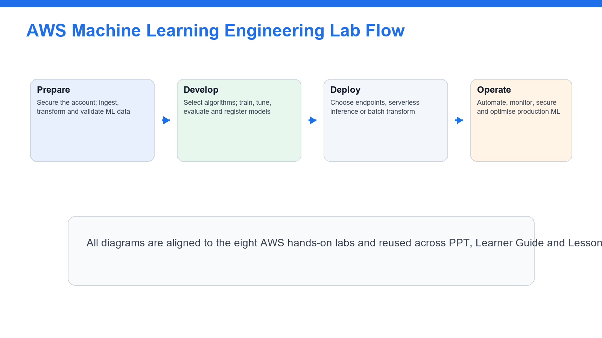
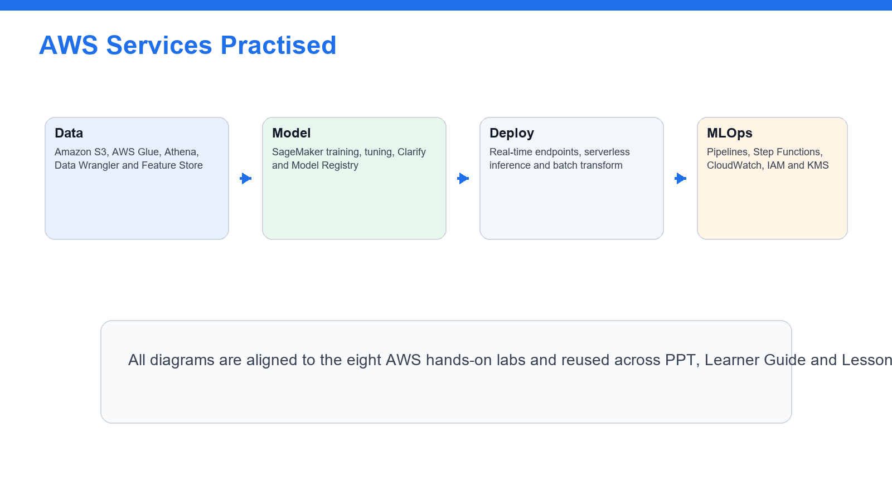
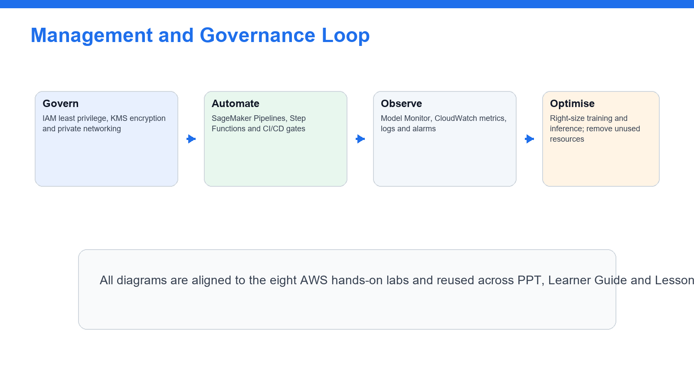

# Learner Guide - AWS Certified Machine Learning Engineer Associate Training

**Course Code:** TGS-2024049340
**Organisation:** Tertiary Infotech Academy Pte Ltd (UEN: 201200696W)
**Version:** 2

This Markdown guide mirrors the Learner Guide DOCX and is generated from the same eight lab markdown files.

## Course Diagrams

## Lab Alignment Matrix

| Lab | AWS MLA-C01 Domain | Title | Source |
| --- | --- | --- | --- |
| 1 | Domain 1 - Data Preparation for Machine Learning | Account Safety, IAM, S3 ML Data Lake, and Data Formats | labs/lab-01-account-iam-s3-ml-data-lake.md |
| 2 | Domain 1 - Data Preparation for Machine Learning | Data Ingestion, Transformation, Feature Engineering, and Data Quality | labs/lab-02-data-ingestion-feature-engineering-quality.md |
| 3 | Domain 2 - ML Model Development | Modeling Approach, SageMaker Algorithms, JumpStart, and AI Services | labs/lab-03-modeling-approach-sagemaker-ai-services.md |
| 4 | Domain 2 - ML Model Development | Training, Hyperparameter Tuning, and Model Registry | labs/lab-04-training-tuning-model-registry.md |
| 5 | Domain 2 - ML Model Development | Model Evaluation, Performance Metrics, and Bias Analysis | labs/lab-05-model-evaluation-performance-bias.md |
| 6 | Domain 3 - Deployment and Orchestration of ML Workflows | Deployment Infrastructure, Endpoints, Batch Transform, and Auto Scaling | labs/lab-06-deployment-endpoints-inference-infrastructure.md |
| 7 | Domain 3 - Deployment and Orchestration of ML Workflows | MLOps Pipelines, CI/CD, and Workflow Orchestration | labs/lab-07-mlops-pipelines-cicd-orchestration.md |
| 8 | Domain 3 - Deployment and Orchestration of ML Workflows | Monitoring, Security, Cost Optimization, and Exam Review | labs/lab-08-monitoring-security-cost-exam-review.md |

# Lab 1 - Account Safety, IAM, S3 ML Data Lake, and Data Formats

**Day:** Day 1  
**Domain:** Domain 1 - Data Preparation for Machine Learning  
**Source:** `labs/lab-01-account-iam-s3-ml-data-lake.md`

## Lab 1 - Account Safety, IAM, S3 ML Data Lake, and Data Formats

## Objectives

- Configure a safe AWS learning baseline for ML engineering.
- Review IAM roles, policies, and least privilege for SageMaker and data services.
- Create an S3 ML data lake structure if permitted.
- Compare common ML data formats.

## Scenario

Machine learning projects require secure access, controlled storage, and data formats that support training and inference workflows. This lab establishes the baseline for later ML tasks.

## Steps

1. Sign in to the AWS account assigned by your trainer.
2. Confirm you are in the correct region.
3. Open IAM and review users, roles, groups, and policies.
4. Verify MFA where permitted.
5. Review least-privilege access for S3, SageMaker, Glue, Athena, KMS, and CloudWatch.
6. Open SageMaker and review execution role concepts.
7. Open S3.
8. Create a bucket only if your trainer permits it.
9. Enable default encryption.
10. Keep Block Public Access enabled.
11. Create prefixes named `raw/`, `prepared/`, `features/`, `training/`, `models/`, and `monitoring/`.
12. Upload small sample CSV and JSON files to `raw/` if permitted.
13. Review object metadata and storage class.
14. Create a table comparing CSV, JSON, Parquet, ORC, Avro, and RecordIO.
15. Record which formats are best for analytics, streaming, and training workflows.
16. Open KMS and review customer managed key concepts.
17. Save your notes.

## Deliverables

- IAM and least-privilege notes
- S3 ML data lake prefix structure
- Data format comparison table
- Encryption and cost safety notes

## Checkpoint

You should be able to explain how IAM, S3, encryption, and data formats support ML engineering on AWS.

# Lab 2 - Data Ingestion, Transformation, Feature Engineering, and Data Quality

**Day:** Day 1  
**Domain:** Domain 1 - Data Preparation for Machine Learning  
**Source:** `labs/lab-02-data-ingestion-feature-engineering-quality.md`

## Lab 2 - Data Ingestion, Transformation, Feature Engineering, and Data Quality

## Objectives

- Compare data ingestion and transformation services for ML workflows.
- Review feature engineering techniques.
- Understand data quality, labeling, and bias checks.
- Design a raw-to-training data preparation workflow.

## Scenario

ML models depend on high-quality, well-prepared data. You will design a workflow for ingesting, cleaning, transforming, labeling, and validating data.

## Steps

1. Open AWS Glue.
2. Review crawlers, jobs, Data Catalog, and Glue Data Quality concepts.
3. Open SageMaker Data Wrangler or review its documentation if access is unavailable.
4. Review transformations such as missing-value imputation, normalization, standardization, binning, and one-hot encoding.
5. Open SageMaker Feature Store or review feature group concepts.
6. Record online and offline feature store use cases.
7. Open SageMaker Ground Truth or review labeling job concepts.
8. Review labeling use cases for text, image, and tabular data.
9. Review SageMaker Clarify concepts for data bias detection.
10. Create a feature engineering checklist for a sample customer churn dataset.
11. Create a data quality checklist covering nulls, duplicates, schema mismatch, outliers, class imbalance, and data leakage.
12. Design a pipeline from S3 raw data to prepared features in S3 or Feature Store.
13. Identify which services would transform batch data and streaming data.
14. Save your notes.

## Deliverables

- Data preparation workflow
- Feature engineering checklist
- Data quality and bias checklist
- Service selection notes

## Checkpoint

You should be able to explain how AWS services prepare data, features, labels, and quality checks for ML modeling.

# Lab 3 - Modeling Approach, SageMaker Algorithms, JumpStart, and AI Services

**Day:** Day 1  
**Domain:** Domain 2 - ML Model Development  
**Source:** `labs/lab-03-modeling-approach-sagemaker-ai-services.md`

## Lab 3 - Modeling Approach, SageMaker Algorithms, JumpStart, and AI Services

## Objectives

- Choose ML approaches based on business problems and data.
- Compare SageMaker built-in algorithms, custom training, JumpStart, Bedrock, and AI services.
- Review interpretability, cost, and feasibility tradeoffs.
- Create a model selection matrix.

## Scenario

ML engineers must select the right model approach before training. Some problems require custom models, while others can use managed AI services or foundation models.

## Steps

1. Review common ML problem types: classification, regression, clustering, forecasting, anomaly detection, NLP, and computer vision.
2. Open SageMaker or SageMaker documentation.
3. Review built-in algorithm categories.
4. Review script mode for custom frameworks such as TensorFlow, PyTorch, or scikit-learn.
5. Open SageMaker JumpStart and review prebuilt models or solution templates.
6. Open Amazon Bedrock and review foundation model use cases if available.
7. Review AI services such as Rekognition, Translate, Transcribe, Comprehend, and Textract.
8. Create a model/service selection table for five business scenarios.
9. Include data type, expected output, candidate service, interpretability need, cost consideration, and operational complexity.
10. Identify when an AI service is better than training a custom model.
11. Identify when a SageMaker training job is more appropriate.
12. Save your notes.

## Deliverables

- ML problem type notes
- SageMaker and AI service comparison table
- Model/service selection matrix
- Cost and interpretability notes

## Checkpoint

You should be able to choose an AWS modeling approach based on data, business outcome, cost, and operational requirements.

# Lab 4 - Training, Hyperparameter Tuning, and Model Registry

**Day:** Day 1  
**Domain:** Domain 2 - ML Model Development  
**Source:** `labs/lab-04-training-tuning-model-registry.md`

## Lab 4 - Training, Hyperparameter Tuning, and Model Registry

## Objectives

- Review SageMaker training job concepts.
- Understand epochs, batch size, steps, regularization, and overfitting controls.
- Design a hyperparameter tuning strategy.
- Manage model versions with Model Registry.

## Scenario

After choosing a modeling approach, ML engineers need repeatable training, tuning, evaluation, and versioning workflows.

## Steps

1. Open SageMaker Training jobs.
2. Review training input, output path, instance type, container image, and execution role concepts.
3. Review script mode and framework estimator concepts.
4. Record the meaning of epoch, batch size, learning rate, steps, and early stopping.
5. Review regularization techniques such as L1, L2, dropout, pruning, and feature selection.
6. Review distributed training and cost tradeoffs.
7. Open Automatic Model Tuning concepts.
8. Compare random search, grid search, and Bayesian optimization at a high level.
9. Create a tuning plan for a sample classification model.
10. Include objective metric, hyperparameters, ranges, stopping condition, and cost limit.
11. Open Model Registry.
12. Review model package groups, versions, approval status, and metadata.
13. Design a model versioning workflow from training to approval.
14. Save your notes.

## Deliverables

- Training job concept notes
- Hyperparameter tuning plan
- Regularization and overfitting notes
- Model Registry workflow

## Checkpoint

You should be able to explain repeatable model training, tuning, and version control on AWS.

# Lab 5 - Model Evaluation, Performance Metrics, and Bias Analysis

**Day:** Day 2  
**Domain:** Domain 2 - ML Model Development  
**Source:** `labs/lab-05-model-evaluation-performance-bias.md`

## Lab 5 - Model Evaluation, Performance Metrics, and Bias Analysis

## Objectives

- Compare model evaluation metrics.
- Diagnose overfitting, underfitting, and poor generalization.
- Review bias and explainability tools.
- Build an evaluation and acceptance checklist.

## Scenario

Models should not be promoted based on training accuracy alone. This lab covers evaluation metrics, model behavior, bias, and performance analysis.

## Steps

1. Create a table of model types and evaluation metrics.
2. Include classification metrics such as accuracy, precision, recall, F1 score, ROC AUC, and confusion matrix.
3. Include regression metrics such as MAE, MSE, RMSE, and R-squared.
4. Include ranking or recommendation metrics if assigned by your trainer.
5. Review what overfitting and underfitting look like in train and validation metrics.
6. Review class imbalance and data leakage examples.
7. Open SageMaker Clarify or review its documentation.
8. Record bias metrics and explainability concepts.
9. Review feature importance and SHAP value concepts at a high level.
10. Design an evaluation plan for a binary classification model.
11. Define train, validation, and test split strategy.
12. Define minimum acceptable metrics and approval criteria.
13. Define bias, fairness, and explainability checks.
14. Save your notes.

## Deliverables

- Evaluation metric comparison table
- Overfitting and underfitting notes
- Bias and explainability notes
- Model acceptance checklist

## Checkpoint

You should be able to choose model metrics, interpret evaluation results, and identify when more data preparation or tuning is needed.

# Lab 6 - Deployment Infrastructure, Endpoints, Batch Transform, and Auto Scaling

**Day:** Day 2  
**Domain:** Domain 3 - Deployment and Orchestration of ML Workflows  
**Source:** `labs/lab-06-deployment-endpoints-inference-infrastructure.md`

## Lab 6 - Deployment Infrastructure, Endpoints, Batch Transform, and Auto Scaling

## Objectives

- Compare SageMaker deployment options.
- Review real-time endpoints, serverless inference, asynchronous inference, and batch transform.
- Understand auto scaling and endpoint monitoring.
- Select infrastructure based on requirements.

## Scenario

ML models need different deployment patterns depending on latency, throughput, cost, and architecture. This lab focuses on inference infrastructure choices.

## Steps

1. Open SageMaker Inference or review deployment documentation.
2. Review real-time endpoint concepts.
3. Review serverless inference concepts.
4. Review asynchronous inference concepts.
5. Review batch transform concepts.
6. Review multi-model endpoints and multi-container endpoints at a high level.
7. Review model artifact, container image, endpoint configuration, and endpoint concepts.
8. Review endpoint auto scaling metrics such as invocations per instance.
9. Create an inference option comparison table.
10. Include latency, throughput, payload size, traffic pattern, cost, scaling, and operational complexity.
11. Choose a deployment option for online fraud scoring, nightly batch scoring, image processing, and bursty chatbot requests.
12. Identify where CloudWatch metrics and logs are collected.
13. Identify rollback or blue/green deployment considerations.
14. Save your notes.

## Deliverables

- Inference deployment comparison table
- Use-case deployment choices
- Auto scaling and monitoring notes
- Rollback and operations checklist

## Checkpoint

You should be able to choose an ML deployment option based on latency, traffic, cost, and operational needs.

# Lab 7 - MLOps Pipelines, CI/CD, and Workflow Orchestration

**Day:** Day 2  
**Domain:** Domain 3 - Deployment and Orchestration of ML Workflows  
**Source:** `labs/lab-07-mlops-pipelines-cicd-orchestration.md`

## Lab 7 - MLOps Pipelines, CI/CD, and Workflow Orchestration

## Objectives

- Design an ML workflow from data preparation to deployment.
- Compare SageMaker Pipelines, Step Functions, CodePipeline, and EventBridge.
- Add approval, validation, rollback, and monitoring gates.
- Understand infrastructure as code and automation patterns.

## Scenario

Production ML requires orchestration across data, training, evaluation, model registration, deployment, and monitoring. This lab designs an MLOps pipeline.

## Steps

1. Open SageMaker Pipelines or review its documentation.
2. Review pipeline steps such as processing, training, tuning, condition, register model, and callback.
3. Open Step Functions and review workflow orchestration concepts.
4. Open CodePipeline and CodeBuild for CI/CD concepts.
5. Open EventBridge and review event-driven triggers.
6. Create a comparison table for SageMaker Pipelines, Step Functions, CodePipeline, and EventBridge.
7. Design an ML pipeline with ingest, validate, feature engineering, train, tune, evaluate, register, approve, deploy, and monitor steps.
8. Add failure paths and retry behavior.
9. Add human approval for model promotion.
10. Identify where IaC such as CloudFormation, CDK, or SageMaker project templates could be used.
11. Identify where version control and artifact storage are used.
12. Save your pipeline design.

## Deliverables

- MLOps orchestration comparison table
- End-to-end ML pipeline design
- Approval and rollback notes
- CI/CD and IaC notes

## Checkpoint

You should be able to describe how automated ML workflows move models from development to production safely.

# Lab 8 - Monitoring, Security, Cost Optimization, and Exam Review

**Day:** Day 2  
**Domain:** Domain 3 - Deployment and Orchestration of ML Workflows  
**Source:** `labs/lab-08-monitoring-security-cost-exam-review.md`

## Lab 8 - Monitoring, Security, Cost Optimization, and Exam Review

## Objectives

- Monitor data, models, endpoints, and infrastructure.
- Apply ML security and compliance controls.
- Optimize ML costs.
- Complete certification-style review practice.

## Scenario

The final lab connects monitoring, maintenance, security, cost, and exam readiness for AWS ML engineering workloads.

## Steps

1. Open SageMaker Model Monitor or review its documentation.
2. Review data capture, baseline, data quality, model quality, bias drift, and feature attribution drift concepts.
3. Open CloudWatch.
4. Review endpoint metrics, logs, alarms, dashboards, and anomaly detection.
5. Open CloudTrail and review audit events.
6. Review IAM roles, least privilege, resource policies, and SageMaker execution roles.
7. Review KMS encryption, VPC endpoints, private subnets, and network isolation concepts.
8. Review data classification, masking, anonymization, PII, PHI, and data residency concepts.
9. Create a monitoring checklist for data drift, model quality, latency, errors, cost, and security events.
10. Create a cost optimization checklist covering instance choice, endpoint autoscaling, serverless inference, batch transform, spot training, storage class, and stopping idle notebooks.
11. Map each lab to the exam domains.
12. Complete a timed 30-question practice set from trainer-provided questions or AWS practice resources.
13. Mark weak topics by domain.
14. Clean up temporary resources if instructed.
15. Save final notes.

## Deliverables

- ML monitoring checklist
- Security and compliance checklist
- Cost optimization checklist
- Timed practice score
- Weak-topic revision plan

## Checkpoint

You should be ready to explain AWS ML engineering services, data preparation, model development, deployment, monitoring, security, and exam-style scenario choices.
